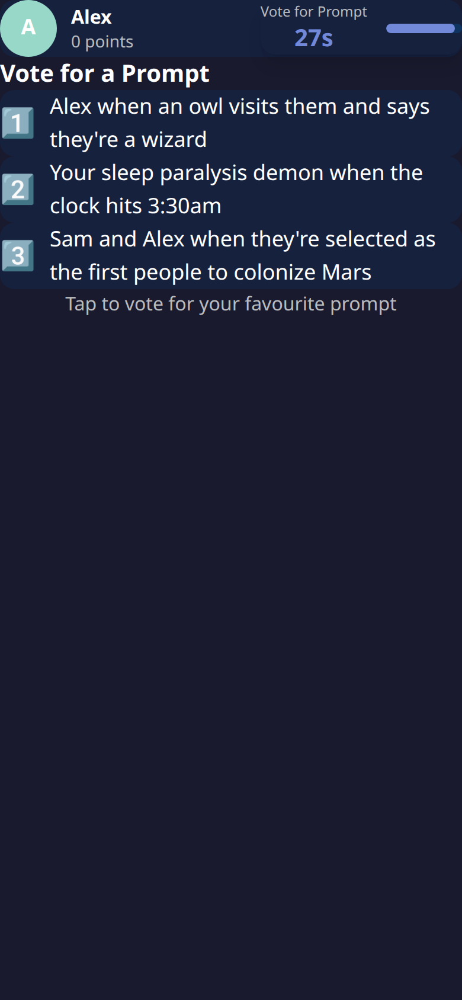
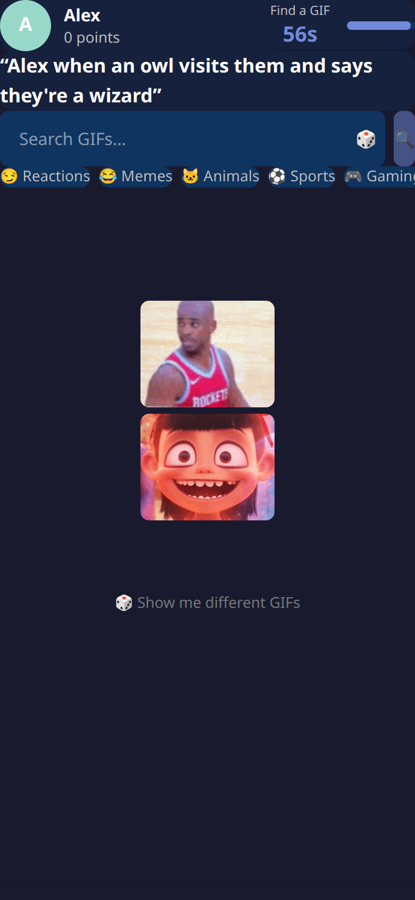

# Know What I Meme

A real-time, Jackbox-style party game: everyone answers a ridiculous prompt with a GIF, then
votes on whose was best. One screen for the room, one phone per player.

Live at **https://saunalserver.xyz/kwim/**

| **Joining is the demo** — phone on the right, big screen on the left, live | **Prompt vote** — pick the round's prompt |
|---|---|
|  |  |
| **GIF search** — find your answer | **The big screen** — synced live during rounds |
|  |  |

## 🎮 How to Play
1. **Create a room** on the big screen and share the 4-letter code (or let players scan the QR).
2. **Join** from any phone at `/kwim` — pick a name and take a selfie or choose an emoji.
3. **Vote on the prompt** for the round from three options.
4. **Find your GIF** with the built-in Klipy search.
5. **Vote for the best** submission — anonymous, and you can't vote for your own.
6. **Win** by racking up points across the rounds (the final round is worth double).

## ✨ Features
- **Real-time**: Socket.io keeps every device in step; a shared countdown runs on the big
  screen *and* on every phone.
- **Survives interruptions**: hosts and players auto-rejoin after a refresh, a dropped tunnel,
  or a locked phone — mid-game disconnects keep the player's score and show a 📴 marker.
- **Mobile-first**: the phone is the controller; no pinch-zoom traps, no iOS input zoom, and it
  respects `prefers-reduced-motion`. Safari-specific layout and animation fixes throughout.
- **Cached GIF search**: repeated searches come from an in-process LRU, and each search pulls
  a term's whole 100-result catalogue in one call, so paging past the first screen is free.
- **Optional offline pool**: keeps a local copy of every GIF a search returns, so a LAN party
  survives the internet dropping out.
- **Path-prefix friendly**: builds and runs under `/kwim/` behind a reverse proxy, or at the
  root for local play.

## 🛠️ Tech Stack
React 19 · Vite 7 · Tailwind 4 · Framer Motion · Lucide · Express 5 · Socket.io 4 ·
Klipy GIF API · Vitest

## 🔑 API Keys & Configuration

Copy `.env.example` to `.env` and fill in:

| Variable | Required | What it's for | Where to get it |
|---|---|---|---|
| `KLIPY_API_KEY` | ✅ | GIF search during rounds | Free account at **https://klipy.com** → dashboard → API key |
| `VITE_PUBLIC_URL` | — | Public address baked into the QR code / join link (e.g. `https://example.com/kwim`). Leave unset for LAN play — the host's own address is used. | Your own deployment URL |
| `PORT` | — | Server port (default `3002`) | — |
| `GIF_CACHE_DIR` | — | Turns on the local GIF pool (below). Unset = off, and nothing is ever downloaded. | A directory with room to spare |
| `GIF_CACHE_MAX_GB` | — | How large that pool may grow (default `5`) | — |

> `VITE_PUBLIC_URL` is baked in at build time — change it and you must `npm run build` again.
> The phone camera used for profile pictures only works over HTTPS, so set it (with a reverse
> proxy) if you want photos.

## 🚀 Setup

You need [Node.js](https://nodejs.org) 20+ and a (free) Klipy API key.

**Option A — Interactive wizard (recommended)**

```bash
./setup.sh
```

Asks for your Klipy key and public URL, writes `.env` (it will not overwrite an existing one
without asking), and installs dependencies.

**Option B — Manual**

```bash
cp .env.example .env   # add your KLIPY_API_KEY
npm install
```

**Development** (hot-reloading frontend + server):

```bash
npm run dev:all         # server on :3002, Vite frontend on :5173
```

**Production** (server serves the built frontend):

```bash
npm run build
npm start               # everything on :3002
```

## 💾 Local GIF pool (optional)

Set `GIF_CACHE_DIR` and the server keeps its own copy of **every GIF a search
returns** — not just the ones players pick. If the GIF API becomes unreachable
mid-party, searches fall back to that pool and the game keeps going.

- Off by default. With `GIF_CACHE_DIR` unset the whole path is inert: no
  directory, no downloads, no fallback.
- Downloads happen in the background, two at a time, so a round never waits.
- Bounded by `GIF_CACHE_MAX_GB`; once full, the least recently seen GIFs are
  evicted. Files nothing in the index claims are swept at startup, so the pool
  cannot quietly grow a pile of unfindable leftovers.
- Pooled GIFs are served back same-origin from `/api/gif/local/<file>`, and only
  files the pool actually owns resolve.
- `GET /api/gif/usage` reports its size, backlog and eviction count.

## 🔧 Scripts
| Command | What it does |
|---|---|
| `npm run dev` | Vite dev server (client) |
| `npm run dev:server` | Express + socket.io with watch |
| `npm run dev:all` | Both at once |
| `npm run build` | Production client into `dist/` |
| `npm start` | Serve the built app and the API from one process |
| `npm test` | Vitest run (86 tests) |
| `npm run test:watch` | Vitest in watch mode |
| `npm run test:coverage` | Coverage report for the server |
| `npm run lint` | ESLint |
| `npm run check` | Lint + tests — run this before committing |

## 🚢 Deploying behind a reverse proxy
The client is built with base `/kwim/`, and the API router is mounted at both `/` and `/kwim`,
so a proxy only needs to forward `/kwim*` and `/socket.io/*` to the app on the same origin.
Socket.io connects to `/socket.io/`, not `/kwim/socket.io/` — give it its own rule.

## 🛡️ License
MIT
